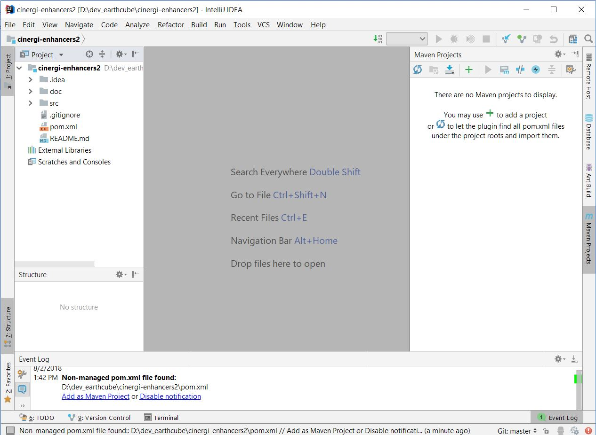
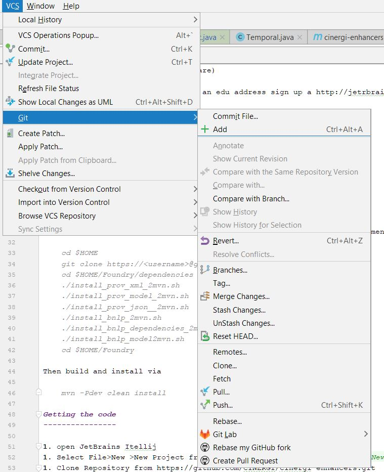
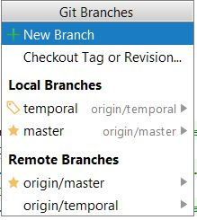
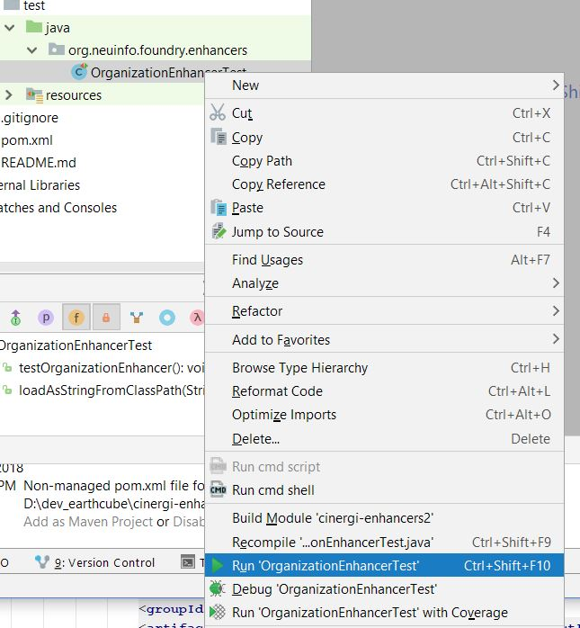
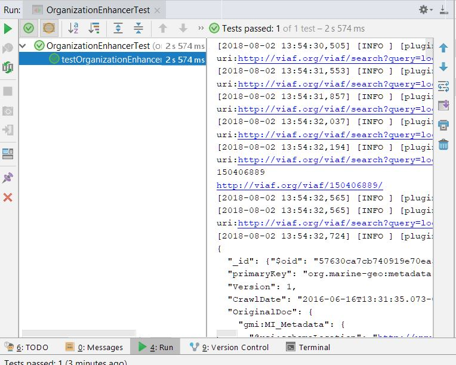
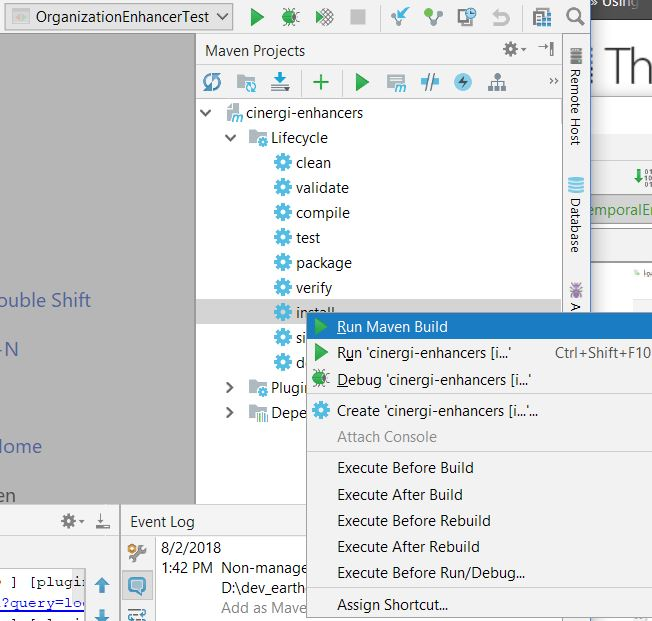

Cinergi Enhancers
=================

This is a starter for building an enhancer for the CINERGI pipeline
It includes 3 sections:

1. Overview and how to configure development environment (This Document)
1. Creating a simple enhancer example, [Building Title Enhancer](BuildingEnhancer.md)
1. Creating a complex example [Temporal Enhancer](TemporalEnhancer.md)
 
Prerequisites
-------------

* Unix like OS (Linux, Mac OSX)
* Java 8 or higher
* Apache Maven (to build the software)
* Java Development environment
  * JetBrains Itellij (if you have an edu address sign up a http://jetrbrains.com/student )


Getting the code
----------------

    cd $HOME
    git clone https://<username>@github.com/CINERGI/cinergi-enhancers
    cd $HOME/cinergi-enhancers

Installing Foundry 
------------------

Enhancer plugin API and Foundry common library used for enhancer development is required for the enhancement development. To get the latest jar files for these libraries you need to clone the Foundry code and build and install these libraries to your local Maven repository.

    cd $HOME
    git clone https://<username>@github.com/CINERGI/Foundry
    cd $HOME/Foundry/dependencies
    ./install_prov_xml_2mvn.sh
    ./install_prov_model_2mvn.sh
    ./install_prov_json__2mvn.sh
    ./install_bnlp_2mvn.sh
    ./install_bnlp_dependencies_2mvn.sh
    ./install_bnlp_model2mvn.sh
    cd $HOME/Foundry

Then build and install via

    mvn -Pdev clean install

Getting the code
----------------

1. open JetBrains Itellij 
1. Select File>New >New Project from Version Control>GitHub  
1. Clone Repository from https://github.com/CINERGI/cinergi-enhancers.git 
put in directory at same level you put foundry at.  
1. Open Project in new window 
1. when project opens, drag cinergi-enhancers/pom.xml to maven tab 
1. select VCS/Git/Branches, and create a new branch  
1. Expand src/test/java and run OrganizationalEnhancerTest.java 
  * results should look similar to: 
1. Right click on maven tab, Install, Run. This will run the maven build.


Now you are ready to code.

Using the command line:
-----------------------

Building
--------

    cd $HOME/cinergi-enhancers
    mvn clean install


Testing the provided Organization Enhancer
------------------------------------------

    cd $HOME/cinergi-enhancers
    mvn test -DskipTests=false

The starter project contains a single enhancer implementation, namely `OrganizationEnhancer` in the `$HOME/cinergi-enhancers/src/main/java/org/neuinfo/foundry/enhancers/plugins` directory.
The corresponding integration test that does not depend on the MongoDB for ease of testing is located at `$HOME/cinergi-enhancers/src/test/java/org/neuinfo/foundry/enhancers/OrganizationEnhancerTest.java`.

# Implementing a new Enhancer

All enhancers need to implement the `org.neuinfo.foundry.consumers.plugin.IPlugin` interface which is located 
in the `consumer-plugin-api` subproject of the Foundry-ES. To develop a new enhancer, you need to include 
the Foundry-ES `common` and `consumer-plugin-api` libraries to your Maven `pom.xml` after you have built it 
via `mvn -Pdev clean install` in addition to all the dependencies from `common/pom.xml` of the Foundry-ES. The Maven build file (`pom.xml`) of the 
starter project contains all of this already.

```xml
<dependency>
   <groupId>org.neuinfo</groupId>
   <artifactId>foundry-common</artifactId>
   <version>1.0-SNAPSHOT</version>
</dependency>
<dependency>
    <groupId>org.neuinfo</groupId>
    <artifactId>foundry-consumer-plugin-api</artifactId>
    <version>1.0-SNAPSHOT</version>
</dependency>

```

The `org.neuinfo.foundry.consumers.plugin.IPlugin` interface is shown below; 

```java
public interface IPlugin {

    public void initialize(Map<String, String> options) throws Exception;

    public Result handle(DBObject docWrapper);

    public String getPluginName();
}
```

The enhancement is done in the `handle(DBObject docWrapper)` method which takes a Mongo `DBObject` 
object corresponding to the currently processed [document wrapper](doc/doc_ingestion.md) from the Mongo database. 
The original document is stored inline in the document wrapper. 
Below is a code fragment to get the original document converted to JSON from the `docWrapper`.

```java
BasicDBObject data = (BasicDBObject) docWrapper.get("Data");
DBObject originalDoc = (DBObject) docWrapper.get("OriginalDoc");
JSONObject json = JSONUtils.toJSON((BasicDBObject) originalDoc, false);

```

To convert a Mongo Java driver database object to JSON you can use the following snippet

```java
JSONObject json = JSONUtils.toJSON((BasicDBObject) originalDoc, false);
```

Similarly, a manipulated json object can be put to the document wrapper using Java code similar to the following

```java
DBObject data = (DBObject) docWrapper.get("Data");
DBObject spatial = JSONUtils.encode(spatialJson, false);
data.put("spatial", spatial);
```

The `handle` method returns its result using the following Java code snippet

```java
return new Result(docWrapper, Result.Status.OK_WITH_CHANGE);
```

If there is an error occurred during the enhancement you need to return an error result as shown below;

```java
Result r = new Result(docWrapper, Result.Status.ERROR);
r.setErrMessage(errorMessage);
return r;
```

To get more information about writing new enhancers, please check to code of the existing enhancers under the 
package `org.neuinfo.foundry.consumers.jms.consumers.plugins` namely 
`KeywordEnhancer2`, `SpatialEnhancer2`, `OrganizationEnhancer2` and `WAFExporter`.

# Deploying enhancers

Once developed and tested, the enhancer(s) needs to be deployed to the Foundry system. The consumer coordinator/head component of Foundry that manages the lifecycle of the enhancers dynamically loads external enhancers from a prespecified plugins directory. The plugin directory is specified in the meta configuration file (See $HOME/Foundry/bin/config-spec.yml.example for an example) using the `pluginDir` parameter. 
You need first build a jar file of your enhancer(s) and copy it to the `pluginDir` location. 

    cd $HOME/cinergi-enhancers
    mvn clean install
    cp $HOME/cinergi-enhancers/target/cinergi-enhancers-1.0-SNAPSHOT.jar <pluginDir>

Any additional libraries you have used (i.e. any new dependencies added to the `pom.xml` file and their dependencies) needs to be added to the plugin library which is determined from the `pluginDir`. For example for plugin directory `/var/data/foundry/consumer_plugins/plugins`, the corresponding external library directory is `/var/data/foundry/consumer_plugins/lib`.

After that, Foundry meta configuration file (See `$HOME/Foundry/bin/config-spec.yml.example` for an example) needs to be update to add the enhancer(s) to the 
workflow ans consumers section of the meta configuration file. 

In the consumers section add a new entry for each enhancer specifiying the full class name of the enhancer and an output status the system will be in after the enhancement in the workflow. For example

```YAML
    - org:
       class: "org.neuinfo.foundry.enhancers.plugins.OrganizationEnhancer"
       status: org_enhanced

```
Any enhancer specific parameters can be specified as name value pairs in the entry after status.

Also add the alias you have given to your enhance (org in the above example) to the `workflow` section of the meta configuration file.


    


